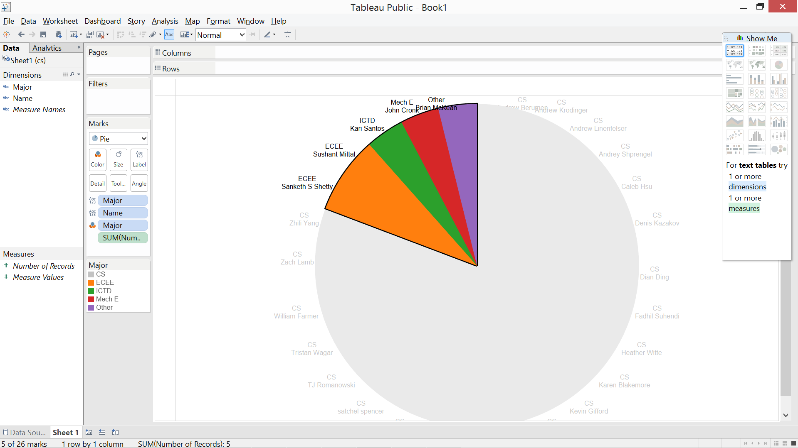
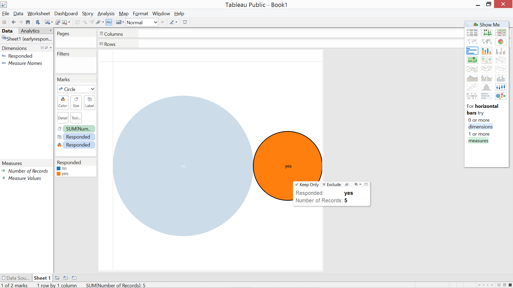
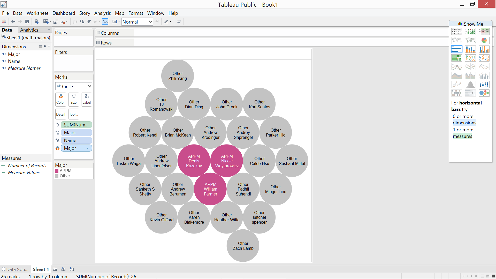
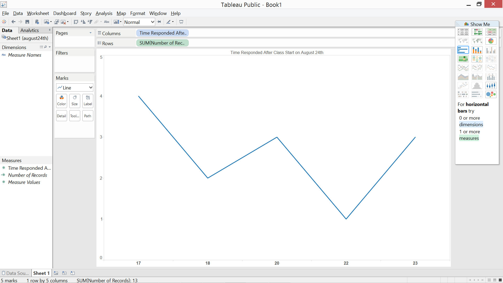

# Tableau Visualization

Tableau is arguably the biggest deal now in terms of data visualization for non-programmers.
Let's pretend you are not a programer. Learn and experience what it is like to make
visualizations using Tableau to answer the same questions about your classmates in our course.

For each of the question, think about what chart you should use to convey your answer and
make your best effort to create something that makes sense to you. There's no right
or wrong. When we meet in the class again, we will set aside time for each team to discuss
and compare the variety of visualization solutions each member has come up with for the
same set of questions. It will be fun!

To include a Tableau visualization in your report, take a screenshot, save it as an image,
put it in the `learning/week2` folder, and replace ``  with
your own image. Please makes sure your screenshot includes the _entire_ Tableau interface
including the controls, widgets ...etc.

# How big the deal Tableau really is?

On quora it has 6.5K followers. Highest followers number on Quora is around 50K. Therefore, we can say that Tableau is realtively popular, especially in its own circle of non programmers who use it for data visualization. 

#Who is not a computer science major?

John Cronk,Sushant Mittal,Sanketh S Shetty,Brian McKean, are not computer science major.
#How many people responded before the first day of class (August 24th)?

5 have responded before first class date.
#How many people are applied math major? Who are they? 	

We have 3 Applied Math students. William Farmer,Denis Kazakov,Nicole Woytarowicz are Applied Math major.
#Of people that responded on 24th, how many people responded after class began? 

13 Responded after the class start time on 24th of August.