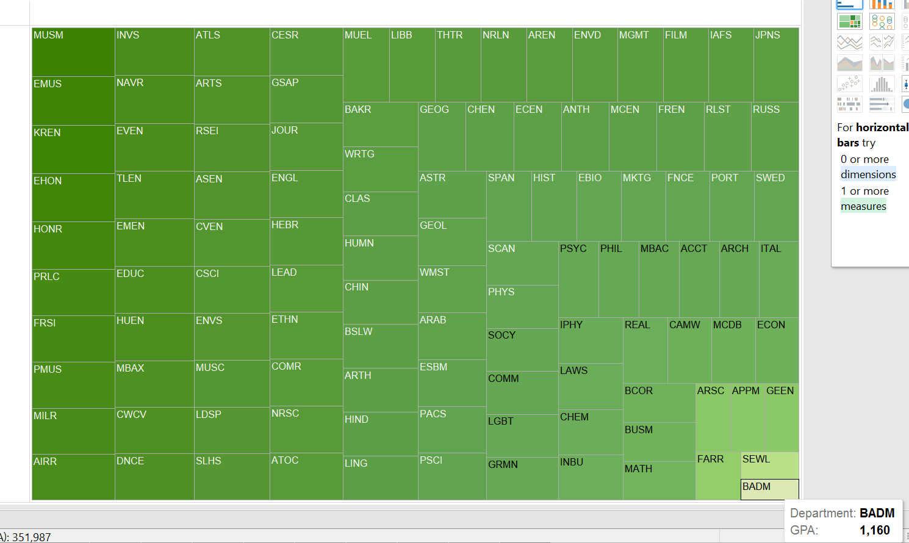
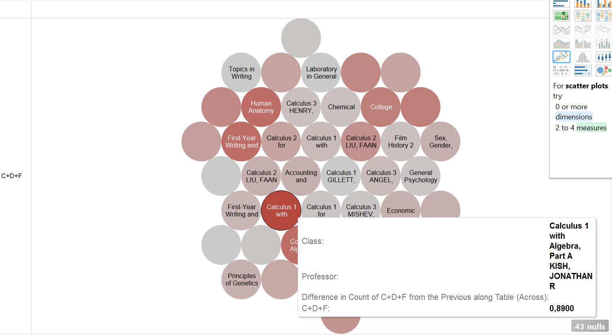
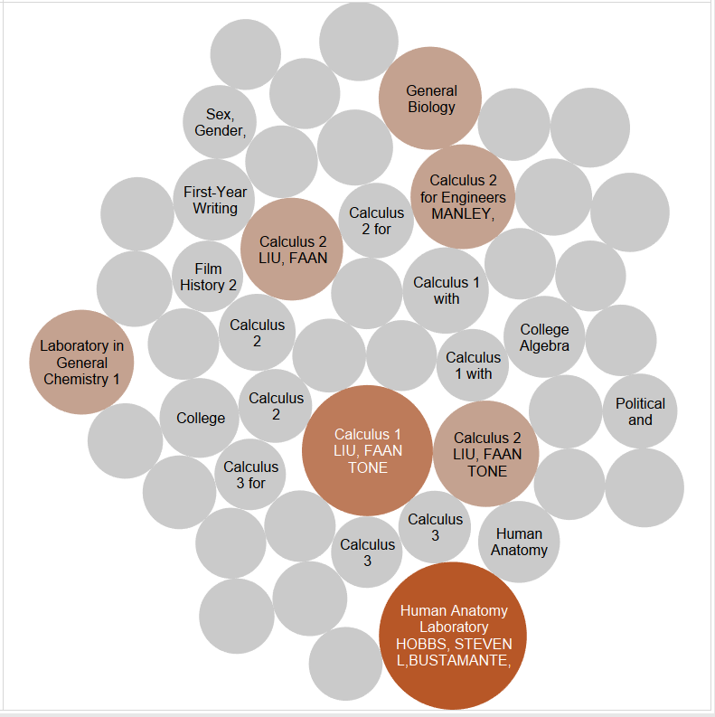
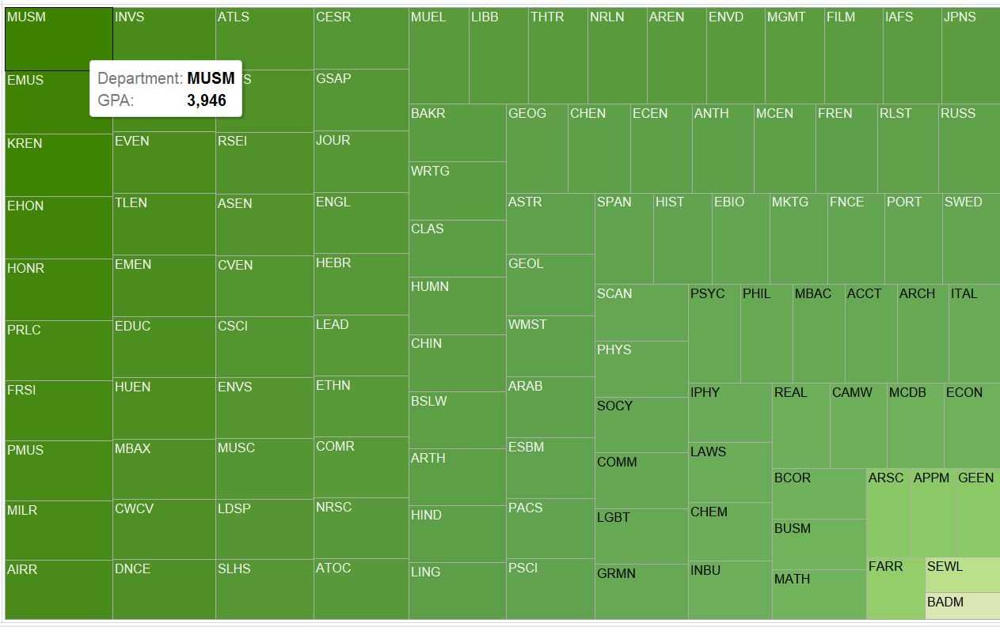
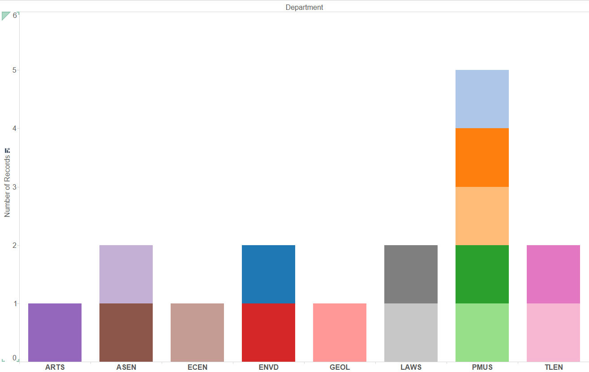
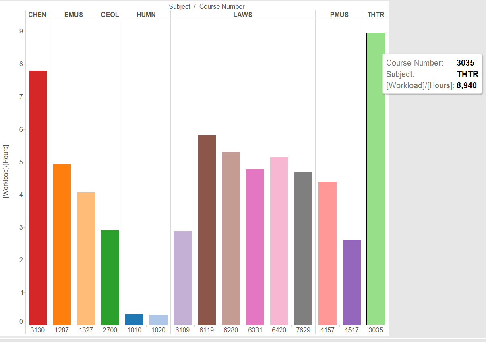

# Visualization

Using Tableau, create visualization for each question in the report. You will
work on this independently just like last week.

To include a Tableau visualization in your report, take a screenshot, save it as an image,
put it in the `learning/week2` folder, and replace ``  with
your own image. Please makes sure your screenshot includes the _entire_ Tableau interface
including the controls, widgets ...etc.

# Import

Data: [fcq.clean.json](https://github.com/bigdatahci2015/book/blob/master/hackathons/fcq/fcq.clean.json)

(a copy of this file is in your book repository already in the directory `hackathons/fcq`)

This dataset is provided to you in the JSON format. Your first task is to figure out
how to transform this JSON file into a format that can be fed into Tableau. As
a junior and senior, you are expected to be able to look around the Internet
to problem solve.

# What department has the lowest average GPA? by Nicole Woytarowicz

As you see, BADM has the the lowest GPA of 1.16.

# Which classes(with specific professors) damaged the most students (sort by:C + D + F rating)? by Denis Kazakov

As you see, there are two ways to interpret the data. One gives you an overall winner in highest CDF rating which is Calculus 1 with Kish. But we can also interpret the data as the sum of CDF ratings for classes. This way Human Anatomy Lab wins as it is consistently really high CDF scores. 

# What department should I take classes in if I want to boost my GPA? by Caleb Hsu

Same as with GPA, but the opposite. I should take classes in the Museum department if I want to boost my GPA.

# Which classes have the maximum Hours spent (16+) per week? by Parker Illig

We see that PMUS has most classes that passed our filter of 16+ hours. 

What classes have very different workloads compared to credit hours? by John Cronk

There are quite some outliers here, as we see with HUMN being 6 credits. But THTR won this won with the highest ratio of workload/hours. 