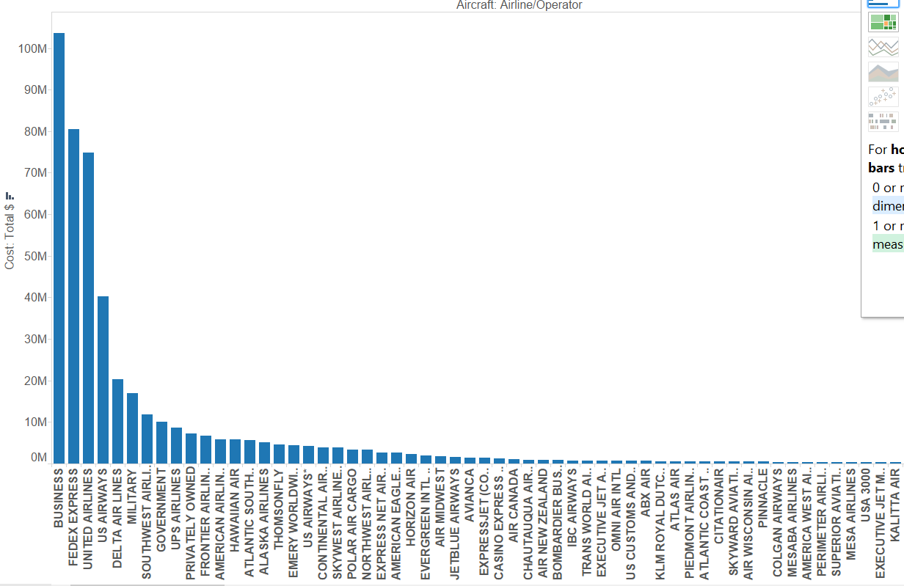
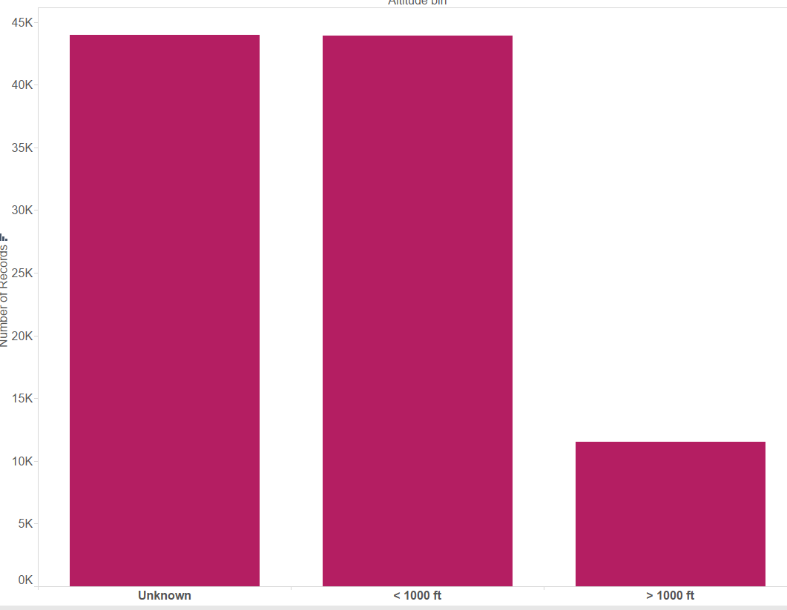
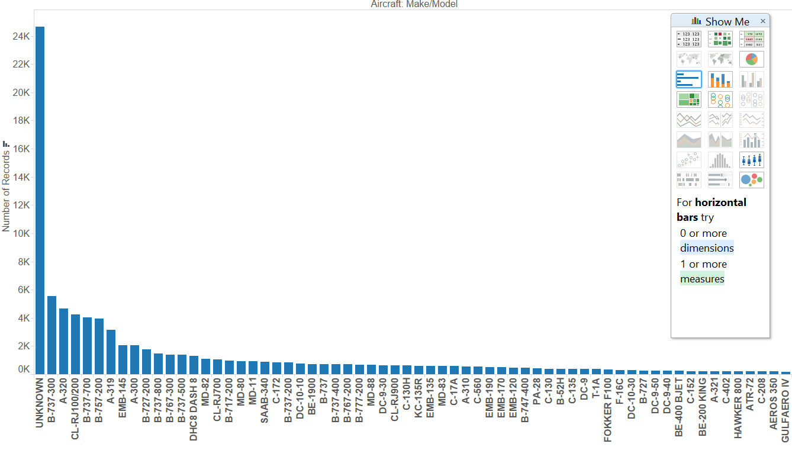
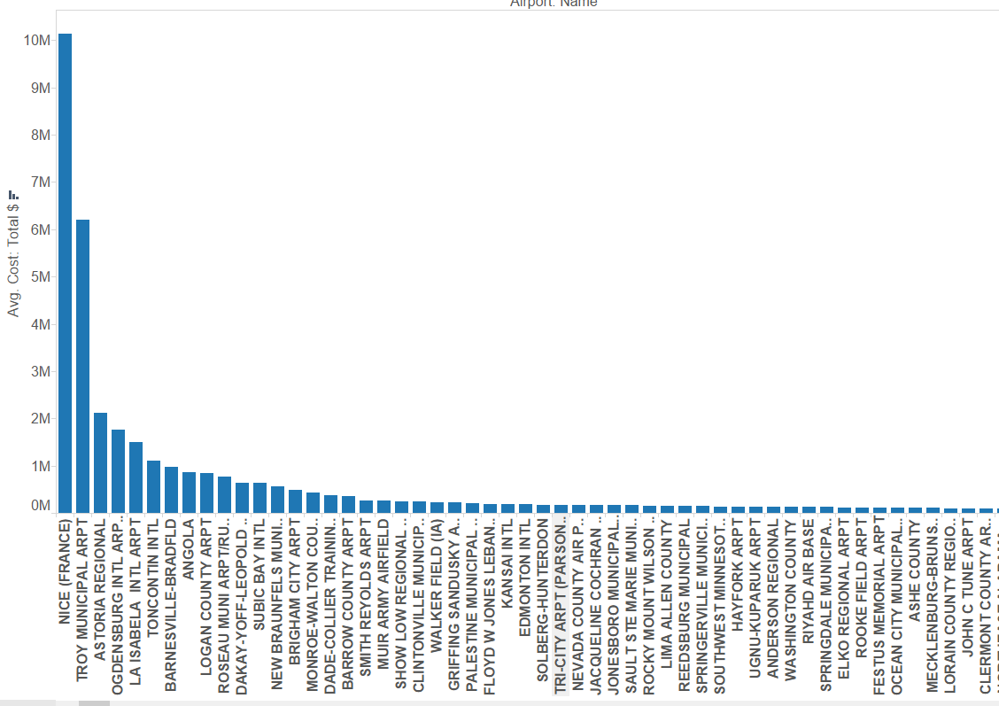
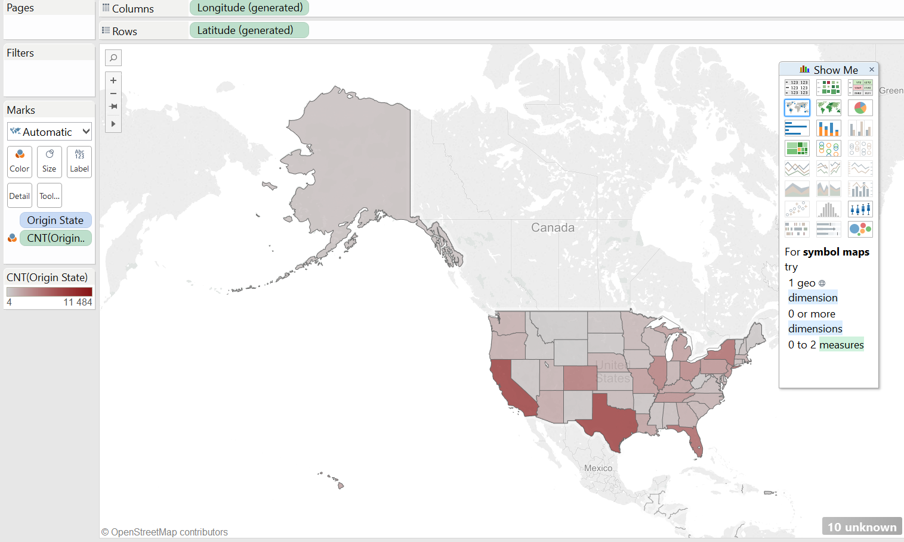
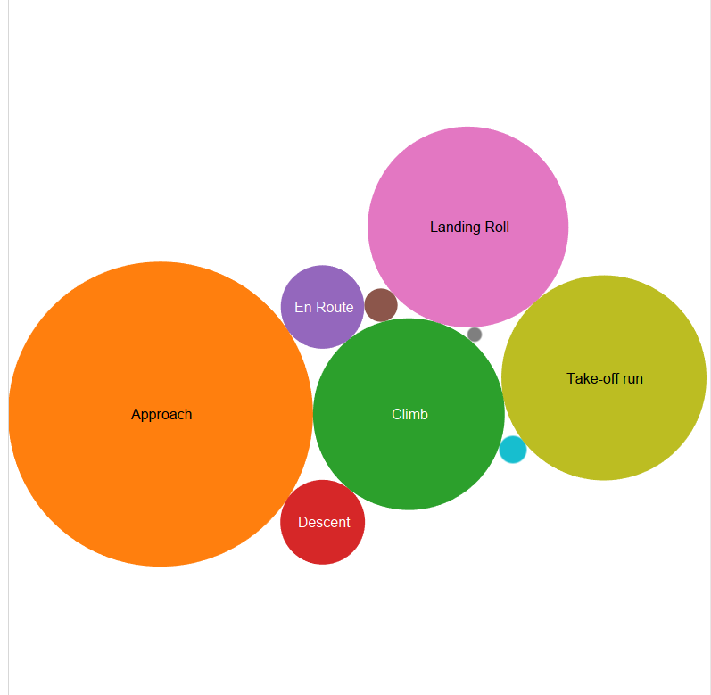

# Report

Using Tableau, create visualization for each question in the report regarding
bird strikes.

# Authors

This report is prepared by
* [Heather Witte](hswitte)
* [Kari Santos](karisantos)
* [fadhil suhendi](fadhilfath)
* [Zachary Lamb](ZachLamb)
* [Denis Kazakov](94kazakov)

# Which airlines have the worst luck with birdstrikes in terms of damage caused?

This question was asked by (calebhsu).

(write your explanation for the reader as to where to look at this chart in order
    to see the answer)

# What is the frequency of bird strikes at various height ranges?

This question was asked by (karisantos).

(write your explanation for the reader as to where to look at this chart in order
    to see the answer)

# Which plane model strikes the most birds?

This question was asked by (twagar95).

(write your explanation for the reader as to where to look at this chart in order
    to see the answer)

# What airports have the most expensive average accident?

This question was asked by (satchelspencer).

(write your explanation for the reader as to where to look at this chart in order
    to see the answer)    

#	What state had the highest number of bird strikes? (Departure State)

This question was asked by (drewdinger).

(write your explanation for the reader as to where to look at this chart in order
    to see the answer)

#	Phase of flights? (Departure State)

This question was asked by ().

(write your explanation for the reader as to where to look at this chart in order
    to see the answer)
